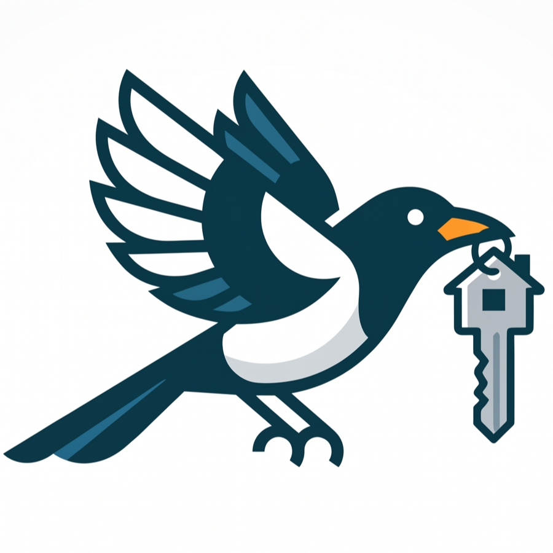

#  KamerCatch


**KamerCatch** is a self-hosted housing radar for **Enschede** that watches Dutch
rental/student platforms, triages new listings with an AI gatekeeper and a commute
filter, drafts personalized inquiry emails, and lets you approve applications
straight from Discord — all from a single `docker compose up`.

## What it does

1. **Scrapes** Kamernet, Marktplaats, Pararius, Roomspot, and Xior on a ~15-minute
   jittered loop (single stealth-browser worker).
2. **Triages** every new listing through:
   - a **bike-commute filter** (OSRM routing to the UTwente campus),
   - **Hermes Pass 1** — a strict AI gatekeeper that rejects Dutch-only /
     no-students / Master's-only listings (`auto_rejected`),
   - **Hermes Pass 2** — an AI drafter that writes a tailored NL/EN inquiry email.
3. **Notifies** you on Discord — a simple webhook for cheap high-priority alerts,
   plus a **bot** that posts drafted listings as embeds with action buttons.
4. **Applies** with one tap — `[✅ Send Application]` drives headless Playwright to
   fill the platform contact form and submit (human-in-the-loop; `DRY_RUN` mode
   screenshots instead of sending).
5. **Manages** everything in the Next.js dashboard: a Kanban board
   (`Drafted → Applied → Rejected`), a shadow "Filtered" tab for `auto_rejected`
   listings, and a Configurator for platform toggles and dealbreakers.

## Tech stack

- **Worker:** Playwright + TypeScript (stealth), discord.js, libSQL client
- **Database:** SQLite (WAL mode) via Turso/libSQL
- **AI:** any OpenAI-compatible API (OpenAI / DeepSeek / Ollama / vLLM)
- **Routing:** OSRM + Nominatim (OpenStreetMap)
- **Dashboard:** Next.js 14 (App Router) + Tailwind CSS

## Quick start

```bash
# 1. Clone and configure
git clone <repo-url> kamerCatch
cd kamerCatch
cp .env.example .env
#    → fill in DISCORD_* and (optionally) HERMES_API_KEY

# 2. Start everything
docker compose up --build -d

# 3. Open the dashboard
open http://localhost:3000
```

The worker exposes a health endpoint at `http://localhost:8080/health`.

## Configuration

All configuration lives in `.env` (see [`.env.example`](.env.example)):

| Variable                                              | Purpose                                                 |
| ----------------------------------------------------- | ------------------------------------------------------- |
| `DISCORD_WEBHOOK_URL`                                 | Text alerts for high-priority listings                  |
| `DISCORD_BOT_TOKEN` / `DISCORD_CHANNEL_ID`            | Embeds + action buttons                                 |
| `EXECUTION_MODE`                                      | `manual` (no Send button) or `auto` (full buttons)      |
| `DRY_RUN`                                             | `true` = fill the form but stop before the final submit |
| `HERMES_BASE_URL` / `HERMES_API_KEY` / `HERMES_MODEL` | AI triage + drafting                                    |
| `OSRM_URL` / `NOMINATIM_URL`                          | Commute routing                                         |
| `ROOMSPOT_*` / `KAMERNET_*`                           | Optional platform credentials for lazy auth             |

Dealbreakers and platform toggles are stored in the `settings` table and can be
edited from the dashboard **Settings** page (no `.env` edit required).

## Architecture

```
docker compose
├── scraper-orchestrator   (scheduler + Discord bot + /health API)
│     ├── scraper-kamernet     (fetch-based)
│     ├── scraper-marktplaats  (Playwright)
│     ├── scraper-pararius     (Playwright)
│     ├── scraper-roomspot     (Playwright)
│     └── scraper-xior         (Playwright, headless by default)
├── frontend-dashboard     (Next.js :3000)
│     ├── /                (Kanban board + shadow tab)
│     └── /settings        (Configurator)
└── data/housing.db        (SQLite WAL, shared volume)
```

## License

MIT
