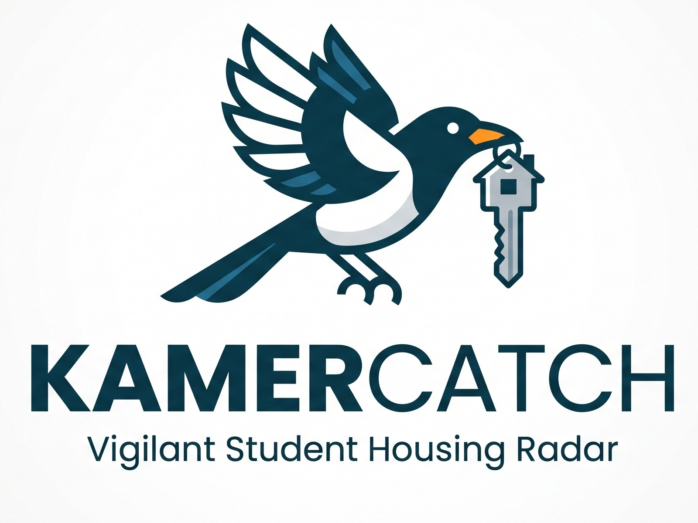

# KamerCatch



KamerCatch helps you find student housing in **Enschede**.

It checks a few rental websites for you, keeps the good matches, hides the bad
ones, and prepares a short message you can send to the landlord. Everything
shows up in one simple dashboard.

## What it does

- **Checks rental websites** on its own, about every 15 minutes.
- **Filters listings** by your rules: price, cycling or walking distance, and
  Dutch-only requirement.
- **Prepares a message** for each good listing, using a template you can edit.
- **Shows everything in a dashboard** where you can sort, filter, and track
  each listing.
- **Can notify you on Discord** (optional).

## What you need

- **Docker** installed on your computer.
- A **Discord server** (if you want Discord notifications).
- Nothing else. Platform logins and Discord notifications are optional.

## Quick start

1. Copy the example settings file:

   ```bash
   cp .env.example .env
   ```

2. Open the `.env` file and fill in the values you want. You can leave most
   empty. The file itself explains each option.

3. Start KamerCatch:

   ```bash
   docker compose up --build -d
   ```

4. Open the dashboard at <http://localhost:3000>.

That's it. The first scan starts right away.

## Optional extras

| What                       | Where to set it                                                                                                               |
| -------------------------- | ----------------------------------------------------------------------------------------------------------------------------- |
| Discord alerts and buttons | `DISCORD_WEBHOOK_URL`, `DISCORD_BOT_TOKEN`, `DISCORD_CHANNEL_ID` in `.env`                                                    |
| Roomspot login             | `ROOMSPOT_USERNAME` and `ROOMSPOT_PASSWORD` in `.env` (a username, not an email)                                              |
| Kamernet                   | `KAMERNET_EMAIL` and `KAMERNET_PASSWORD` in `.env`. Kamernet scrapes without them; they are only needed to message landlords. |

All other settings live in the dashboard under **⚙️ Settings**, so you never
need to edit `.env` or restart anything to change your filters, message
templates, or apply mode.

## Using the dashboard

- **Board** — a Kanban view with New, Drafted, Applied, and Rejected columns.
- **Filtered** — listings that your rules removed. Check it now and then to
  make sure the rules are not too strict.
- **Settings** — platforms, profile, filters, apply mode, and message
  templates.

## Documentation

Want to understand how it works under the hood, or change how it behaves?

- [How KamerCatch works](docs/how-it-works.md) — the step-by-step process and
  logic flow.
- [Editing guide](docs/editing-guide.md) — how to change scrapers, filters,
  templates, and settings.

## Project layout

```
kamercatch/
├── worker/          # the scraper and filtering engine
├── dashboard/       # the web UI (Next.js)
├── docker-compose.yml
├── .env.example
└── docs/            # documentation
```

## License

MIT
