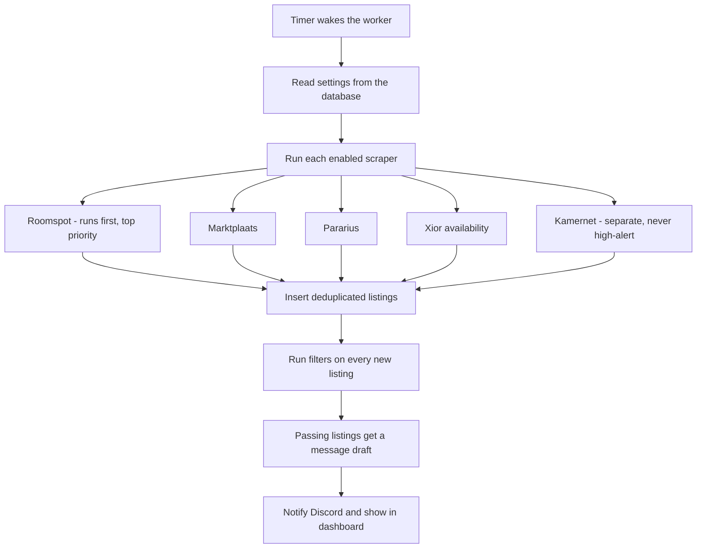

# How KamerCatch works

This page explains the process step by step. You do not need to read it to use
the app, but it helps when you want to change something.

## The three parts

KamerCatch has three parts that talk to each other through a single SQLite
database file.

| Part                             | What it does                                                                                     |
| -------------------------------- | ------------------------------------------------------------------------------------------------ |
| **Worker** (`worker/`)           | Runs on a timer. Scrapes websites, filters listings, prepares drafts, and posts to Discord.      |
| **Dashboard** (`dashboard/`)     | The web UI you open in your browser. Reads the database and lets you change settings.            |
| **Database** (`data/housing.db`) | One file that stores listings and settings. Both the worker and the dashboard read and write it. |

## A full cycle

The worker wakes up about every 15 minutes (plus a small random offset, so the
websites never see a perfectly regular robot).

### Scraping

Each website has its own scraper file in `worker/`:

- [`worker/scraper-roomspot.ts`](../worker/scraper-roomspot.ts)
- [`worker/scraper-marktplaats.ts`](../worker/scraper-marktplaats.ts)
- [`worker/scraper-pararius.ts`](../worker/scraper-pararius.ts)
- [`worker/scraper-xior.ts`](../worker/scraper-xior.ts)
- [`worker/scraper-kamernet.ts`](../worker/scraper-kamernet.ts)

A scraper opens the website, reads the listings, and inserts new ones into the
database. Every scraper runs in its own try/catch block, so if one website
breaks, the others still run.

Each listing gets a stable ID from its URL. If the URL is already in the
database, the listing is not inserted again. There is also a cross-source
check: if another website already has an identical title, rent, and type, the
listing is treated as a duplicate and skipped.

### Filtering (triage)

After scraping, every listing with status `new` goes through
[`worker/shared/triage.ts`](../worker/shared/triage.ts) in this order:

1. **Rent.** If the rent is above `max_rent + rent_flex`, reject. If it is only
   slightly over budget (within `rent_flex`), it is kept and flagged so you can
   still see it.
2. **Dutch-only skip.** If `skip_dutch_only` is on and the listing text says
   Dutch is required, reject.
3. **Distance.** The listing text is searched for phrases like "10 min fietsen"
   or "5 min lopen". If the mentioned cycling or walking minutes are above your
   limits, reject. Listings without any distance info are kept.
4. **Message draft.** If the listing passes, a message is generated from your
   template and the listing moves to `drafted`.

Rejected listings get status `auto_rejected` and appear under the **Filtered**
tab. Nothing is deleted, so you can always restore a listing you disagree with.

### Distance

KamerCatch does **not** calculate routes itself. Listings rarely include a
full street address, so routing would be unreliable. Instead, it reads the
distance that the landlord already wrote in the description, using the patterns
in [`worker/shared/distance.ts`](../worker/shared/distance.ts).

### Dutch-only detection

The worker checks the listing text for Dutch-only phrases using
[`worker/shared/dutch.ts`](../worker/shared/dutch.ts). It runs automatically
inside the worker without fetching extra pages.

## Settings

Settings are stored in the database `settings` table, not in `.env`. That means
you can change them in the dashboard and they apply on the next cycle, with no
restart.

The only values in `.env` are secrets and things that must exist before the
database is ready (Discord tokens, platform logins, and a few tuning values).
See [`.env.example`](../.env.example).

## Applying

The `apply_mode` setting controls how far KamerCatch will go:

| Mode     | What happens                                                           |
| -------- | ---------------------------------------------------------------------- |
| `off`    | No send button. You copy the draft and apply yourself. Safest.         |
| `review` | Fills the platform form and shows you a screenshot, but never submits. |
| `auto`   | Fills and submits when you tap Send.                                   |

Auto-submit is always human-in-the-loop: nothing is submitted unless you tap
the button. The code that fills the forms is in
[`worker/shared/apply.ts`](../worker/shared/apply.ts).

## Notifications

KamerCatch has two optional Discord channels:

- **Webhook** — plain text alerts for high-priority listings and source health
  warnings. Configured with `DISCORD_WEBHOOK_URL`.
- **Bot** — posts drafted listings as embeds with buttons. Configured with
  `DISCORD_BOT_TOKEN` and `DISCORD_CHANNEL_ID`.

The Discord code lives in [`worker/bot.ts`](../worker/bot.ts) and
[`worker/shared/discord.ts`](../worker/shared/discord.ts).
