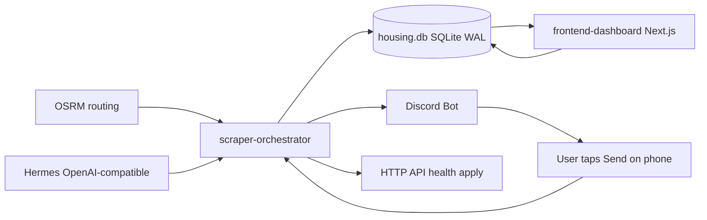

# KamerCatch Implementation Plan

> Rename from **Room Scraper** → **KamerCatch** (crow logo). This plan covers every
> bug fix in [`PROJECT_REVIEW.md`](PROJECT_REVIEW.md) plus the phased v2 roadmap
> (AI triage, Discord bot, CRM dashboard) appended at the end of that file.

## Confirmed Decisions

| Topic                 | Decision                                                                                                                                |
| --------------------- | --------------------------------------------------------------------------------------------------------------------------------------- | ----------------------------- |
| AI provider "Hermes"  | OpenAI-compatible HTTP API — env-var `HERMES_BASE_URL` + `HERMES_API_KEY` + `HERMES_MODEL`                                              |
| Discord notifications | Full bot (discord.js) with slash commands + interactive buttons; bot token available                                                    |
| Commute routing       | OSRM (public demo server or self-hosted), bike profile, no API key                                                                      |
| Application sending   | Full auto-submit with human-in-the-loop; `EXECUTION_MODE=manual                                                                         | auto`and`DRY_RUN=true` toggle |
| Duplicate Roomspot    | Delete [`worker/index.ts`](worker/index.ts) container; Roomspot lives only in the orchestrator                                          |
| Xior                  | Wire into orchestrator (add Xvfb for headed launch) or remove; legacy [`worker/xior_check.py`](worker/xior_check.py) deleted either way |

## Target Architecture

- **One worker container** runs the scheduler loop, the Discord bot, and a small
  HTTP API (`/health`, `/api/apply`, `/api/status`). Auto-submit Playwright runs
  inside this container (Playwright already installed).
- **Dashboard** is read-mostly but writes low-frequency status updates through its
  own API routes; WAL + `busy_timeout` make the occasional concurrent write safe.
- **Hermes** and **OSRM** are plain HTTP integrations inside the worker.

## Phase Mapping

- **P0 — Bug fixes** (B1–B7, 4.10): zero-price guard, Marktplaats skip/typo/ID,
  Pararius ID, Discord emoji, draft filename collisions, SSL + regex, webhook rate limit.
- **P1 — Foundation & consolidation**: kill duplicate Roomspot, isolate scrapers,
  WAL, monitoring, lazy auth, Xior decision, pagination, stable IDs.
- **P2 — Database evolution**: status state machine, `emailed_at`/`last_draft`,
  `settings` key-value table with seeded profile defaults.
- **P3 — AI triage & commute**: OSRM distance filter → `auto_rejected`; Hermes
  Pass 1 gatekeeper → `auto_rejected`; Hermes Pass 2 drafter → `drafted`.
- **P4 — Discord lazy-review loop**: embeds + buttons, execution modes, per-platform
  auto-submit, dry-run screenshots, status transitions.
- **P5 — Next.js command center**: KamerCatch branding, Kanban board, Shadow tab,
  Configurator page, shadcn/ui polish.
- **P6 — Packaging & docs**: unified compose, healthchecks, `npm ci` + `tsc`,
  comprehensive `.env.example`, rebranded README.

## Key Implementation Notes

### Listing ID scheme

Replace per-source prefixed IDs (`kamernet-123`, `mp-a123…`, `pr-<base64>`,
`r-<random>`) with a consistent `hash(url)` (SHA-256, hex) computed on the cleaned
listing URL. Dedup becomes a single `INSERT ... ON CONFLICT(id) DO NOTHING` whose
`rowsAffected` tells us if it was new.

### Status state machine

`new` → `drafted` (Hermes Pass 2 done) → `applied` / `rejected` (human or bot action),
with `auto_rejected` as the shadow state for listings triaged out before display.

### Hermes prompts

- Pass 1 returns a strict `YES|NO` + one-sentence reason against the profile
  dealbreakers (language, pets, age, education level).
- Pass 2 returns a tailored email draft (NL for Dutch platforms, EN otherwise),
  picking out landlord name and room vibe.

### Execution modes (`.env`)

- `EXECUTION_MODE=manual`: embed omits the Send button.
- `EXECUTION_MODE=auto`: full button suite; Send triggers headless Playwright submit.
- `DRY_RUN=true`: Playwright logs in, navigates, fills the form, then stops before
  the final submit and sends a screenshot back to Discord.
